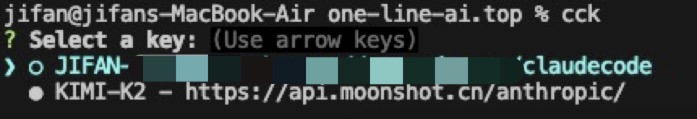
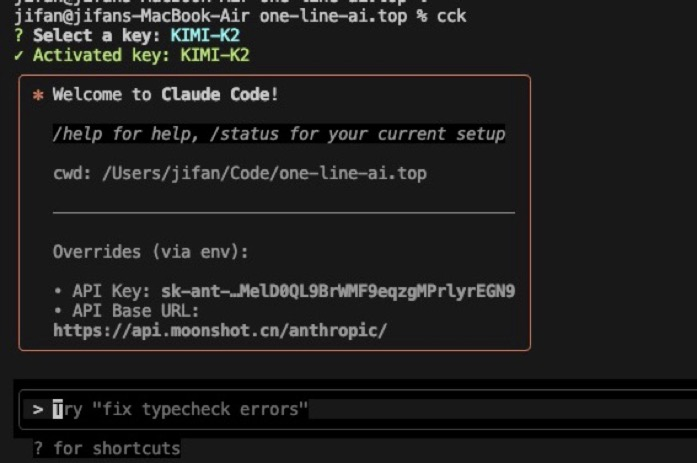

# Claude Code Keys (cck)

A global CLI tool for managing Claude API key configurations with instant environment variable switching.

## Installation

```bash
npm install -g claude-code-keys
```

## Quick Start

1. **Add your first key:**
   ```bash
   cck add
   ```

2. **Switch keys and launch Claude Code:**
   ```bash
   cck
   ```

3. **List keys:**
   ```bash
   cck list
   ```

## Usage

### Commands

| Command | Description |
|---------|-------------|
| `cck` | Interactive key selection and launch Claude Code |
| `cck add` | Add new key configuration |
| `cck list` | List all keys |
| `cck delete [name]` | Delete key |
| `cck help` | Show help |

### Switching Keys

Simply run `cck` to interactively select a key and immediately launch Claude Code with the selected configuration.

```bash
cck
```

This will:
1. Show an interactive list of your configured keys
2. Let you select with arrow keys and press Enter
3. Launch Claude Code with the selected key's configuration

### Adding Keys

```bash
cck add
# Enter key name, base URL, and API key interactively
```

### Switching Keys

Simply run `cck` to interactively select a key and immediately launch Claude Code:

```bash
cck
```

### Listing Keys

```bash
cck list
```

Output shows:
- Active key (●)
- Key names
- Base URLs
- Masked API keys for security

## Configuration

Configuration files are stored in `~/.claude-code-keys/`:
- `config.yaml` - Current active key
- `keys.yaml` - All key configurations

Files have 600 permissions for security.

## Key Structure

Each key contains:
- `name` - Unique identifier
- `ANTHROPIC_BASE_URL` - API base URL
- `ANTHROPIC_API_KEY` - Your API key
- `created` - Creation timestamp


## Examples

### Interactive Key Selection


### Login Interface


```bash
# Add a production key
cck add
# Name: prod
# URL: https://api.anthropic.com
# Key: your-api-key-here

# Add a staging key
cck add
# Name: staging
# URL: https://api-staging.anthropic.com
# Key: your-api-key-here

# Switch keys (interactive selection)
cck
```

## Security

- API keys are encrypted at rest with 600 file permissions
- Keys are masked in terminal output
- No keys are logged or transmitted
- Configuration is stored locally only

## Development

```bash
# Clone repository
git clone <repo-url>
cd claude-code-keys

# Install dependencies
npm install

# Link for local development
npm link

# Run tests
npm test

# Run with coverage
npm run test:coverage
```

## Publishing to NPM

This package is published to the official npm registry. To publish a new version:

```bash
# Switch to official npm registry
npm config set registry https://registry.npmjs.org/

# Login to npm (if not already logged in)
npm login

# Publish to official registry
npm publish

# Switch back to Chinese mirror for development
npm config set registry https://registry.npmmirror.com
```

### Publishing Workflow

1. **Update version** in `package.json`
2. **Run tests** to ensure everything works
3. **Switch to official registry** for publishing
4. **Publish** to npm
5. **Switch back** to Chinese mirror for development

The package is configured as a global CLI tool with the executable name `cck`.

## Requirements

- Node.js >= 16.0.0
- NPM or Yarn

## License

MIT